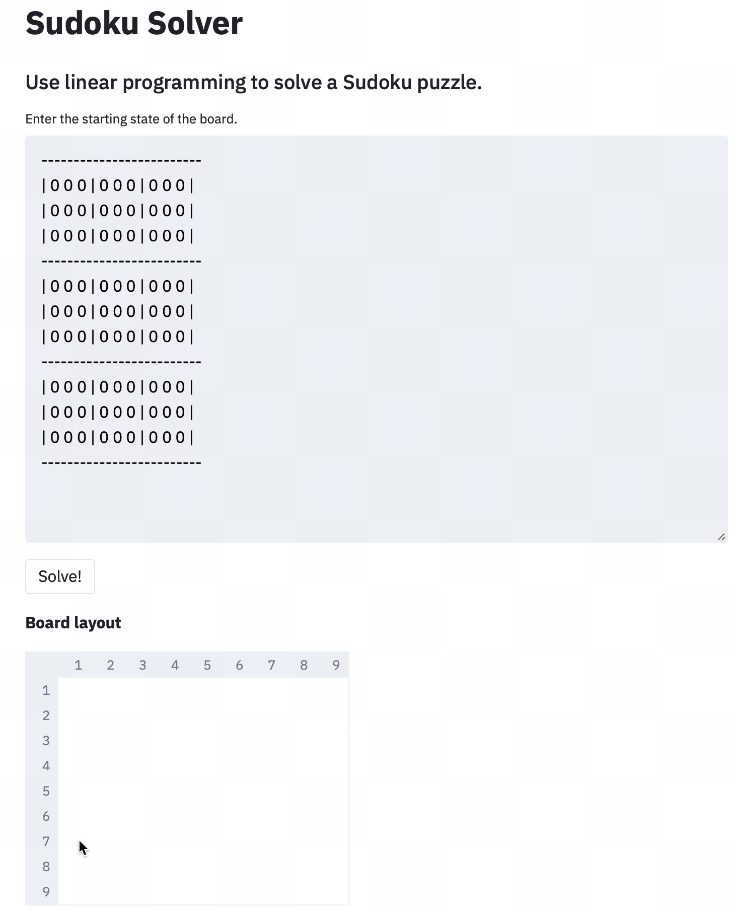

# Sudoku Solver web application

  

  

[**https://streamlit-sudoku-solver.herokuapp.com**](https://streamlit-sudoku-solver.herokuapp.com)

**A fast, interactive web application for solving Sudoku puzzles.**
The solver engine is built using the Linear Programming library [Pyomo](https://www.pyomo.org) and the UI is built with [Streamlit](https://www.streamlit.io).
The website will be hosted on [Heroku](https://heroku.com).

---

